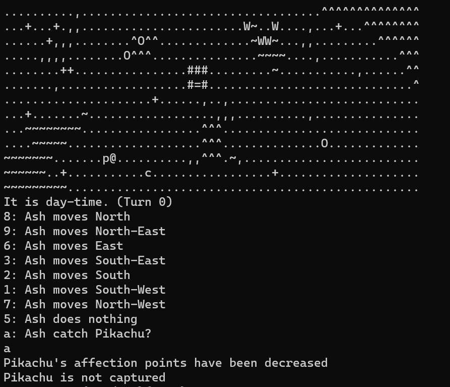

#  Roguelike Pokemon

## Table of Contents

[About](#about) 
[Preview](#preview) 
[Use Instructions](#use) 
[Additional Information](#info) 

## About <a name="about">

#### Features:

## Preview <a name="preview">

#### Starting game world

#### Find items throughout the world

#### Use items to interact with Pokemon

#### Try to catching wild Pokemon

#### Trade with NPCs 

#### Discover in-game events

#### Discover all Pokemons in the world and their evolutions

#### Engage in combat

#### Discover the unique attack sets of each Pokemon

## Use Instructions <a name="use">

#### Download

**IMPORTANT**: Roguelike Pokemon requires the latest versions of Java Runtime Environment (JRE) and Java Developer Kit (JDK) to run.

Follow these steps carefully.

1. Download the latest version of [JRE](https://www.java.com/en/download/manual.jsp) for your system, and follow the installation instructions.
2. Download the latest version of [JDK](https://www.oracle.com/my/java/technologies/downloads/) for your system, and follow the installation instructions.
3. At the top of [this repository page](https://github.com/carsnl/RoguelikePokemon/), click **Code** > **Download ZIP**.
4. Unzip the downloaded file.
5. Click the **RoguelikePokemon** executable file after JRE and JDK have been installed to start the game. This launches the system console/terminal.

The executable file does not work! (Click to expand)

 
If the executable file does not run, navigate to: out > artifact > RoguelikePokemon_jar. Open your system console or terminal in this directory, and type "java -jar RoguelikePokemon.jar" (without quotation marks) to launch the game.

If a linkage error is displayed, the latest version of JDK has not been installed in your system.

#### Game manual

##### Legend

Characters
- @: Ash (player)
- %: Nurse Joy

Pokemons
- c: Charmander
- C: Charmelon
- p: Pikachu
- b: Bulbasaur
- s: Squirtle
- and more!

Items
- *: Candy
- f: (Fire/Water/Grass) Pokefruit
- and more!

Environment
- O: Crater
- ^: Lava
- W: Waterfall
- T: Tree
- =: Door (teleports to another map)
- and more!

Pokemon Special Moves
- /: Raichu's Thunder Wave
- v: Charizard's Fire Spin

When the game exits, it's game over.

Hints (Click to expand)

 
- Try exploring the world and find out what each symbol represents. 
- Pokemons are represented as letters.
- Certain Pokemon spawn on specific environments.
- Offer a wild Pokemon a Pokefruit that matches their type. For example, Bulbausaur loves Grass Pokefruit.
- To catch a Pokemon, increase the affection points (AP) between you and Pokemon first.
- Careful, you can be killed by wild Pokemon!

## Additional Information <a name="info">

The final application presented in this repository is an adapted version from a university project. Developed in collaboration with Anson Wong Sie Yuan and Mior Shazryl Afiq Mior Saifullizan. Game engine provided by Monash University.

Developed with Java.

For enquires, contact [laicarson.swe@gmail.com](laicarson.swe@gmail.com).

